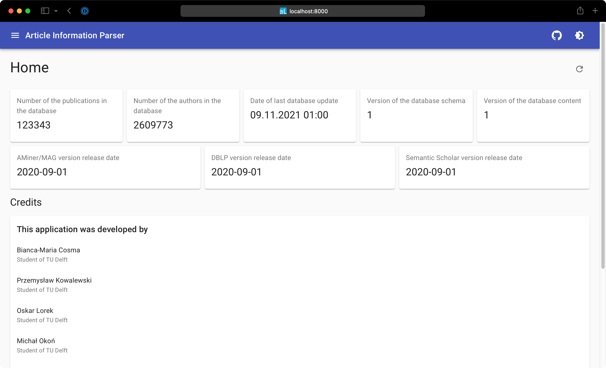

# AIP++

> A Software Tool for Finding Related Work in Academia

<ins>A</ins>rticle <ins>I</ins>nformation <ins>P</ins>arser is an instrument to parse, unify, and in some cases correct article metadata. AIP creates a PostgreSQL database that allows for easily finding related work. AIP++ is an extension of the original tool to improve on the article discovery and querying capabilities of the original tool.

More information on how this tool works can be found in the [project report](https://drive.google.com/file/d/1OUJvakiJYdlw-jV2ZKjDs5ggCNi2DyiW/view).



## Setup

### Prerequisites

:fire: Please read this section before continuing :fire:

In order to run the following application, make sure that you have [Docker](https://www.docker.com/products/docker-desktop).

It is also important that you have a recent version of the database which can be obtained by contacting us directly. You can also generate your own database by following the instructions [here](backend/automatic_checks/automatic_check_readme.md).

### Running the application locally using Docker

0. Ensure you have a recent database dump called `data.backup` in the `db` folder of this repository.

1. Build and run the Docker containers to run this project.
```sh
$ docker-compose up --build -d
```

2. Access the application through your web browser by going to http://localhost:8000
   
### Useful tips

Use `docker-compose up --build` to rebuild your project. This is useful, if you
want to update the application after pulling it from git.

If you want to update the database, you will have to remove the database volume by: 
1. Shutting down all containers with: `docker-compose down`.
2. Find the appropriate Docker volume which you can find using `docker volume ls`. It is prefixed with the name of the root folder (usually `aip`) and ends with `_db_data`.
3. Removing the previously mentioned volume with `docker volume rm <volume_name>`


## Rationale

Managing a database of article metadata is tricky, as highlighted by an excerpt from [our article introducing AIP](https://arxiv.org/abs/2004.10077):

> Current information sources do not cover the spectrum of the systems community entirely. For example, DBLP -- which specifically focuses on computer science articles -- lacks certain venues and does not record article abstracts.  Other datasets such as Semantic Scholar and AMiner have similar and other limitations.
Moreover, these datasets also overlap, yet contain important information the others do not offer; they are disjoint.
Our approach is to parse each dataset and filter and unify the information provided.

AIP combines three data sources, namely [DBLP](https://dblp.uni-trier.de/faq/How+can+I+download+the+whole+dblp+dataset), [Semantic Scholar](https://api.semanticscholar.org/corpus/download/), and [AMiner](https://www.aminer.cn/oag2019).

DBLP is a well-known European archive that focuses on computer science and features all the top-level venues (journals and conferences).
Semantic Scholar is an American project created by the Allen Institute for AI.
The project aims to analyze and extract important data from scientific publications.
AMiner is an Asian project that aims to provide a knowledge graph for mining academic social networks.
Both AMiner and Semantic Scholar have incorporated Microsoft's Academic Graph (MAG) in their datasets nowadays.

AIP tackles several non-trivial challenges in unifying these datasets:
1. Data discrepancies between sources. For example, titles in DBLP end with a dot, whereas they do not in the Semantic Scholar and AMiner corpuses, causing exact matching to fail.
2. Titles and abstracts may contain encoded characters leading to mismatching articles that are in fact the same.
3. Despite all data sources having a format specified, we encountered several instances where the format specified is not adhered to, or the data is malformed.
4. Venue strings being different among these sources. Some sources use an abbreviation, some use a BibTeX string, etc. AIP maps all these occurrences to the same abbreviation.
5. Complementing existing entries. For example, DBLP does not offer abstracts whilst Semantic Scholar and AMiner do.