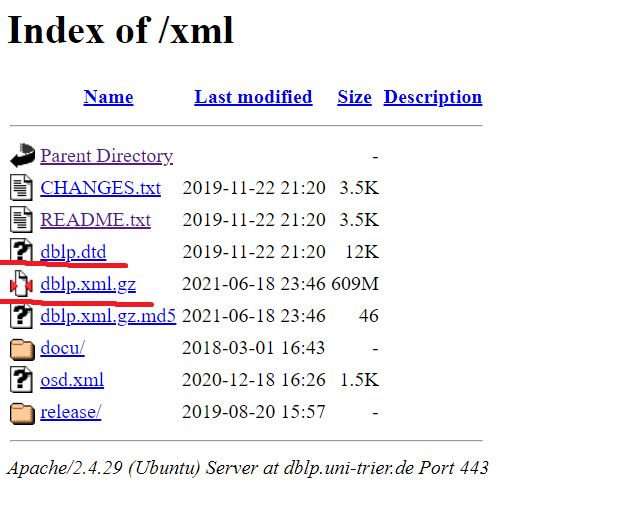
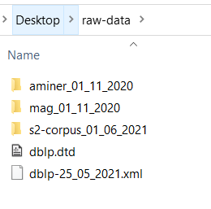

Disclaimer: to update the database one would need around 1TB of storage available and about 30h of computation time. 

In order to update the database you must download all 4 data sources and parse them. 

1. Create a new folder where all the input files will be stored

2. Go to https://dblp.uni-trier.de/xml/ and download the `dblp.xml.gz` and `dblp.dtd` files

   
   
3. Add three new folders. One for Semantic Scholar, one for MAG, and one for Aminer. Adding the data to the folder is optional, but if you do it should look like this:

   


4. Go to https://www.aminer.org/open-academic-graph click the latest version available and download all the aminer_papers and mag_papers files, placing them in the aminer and mag directories respectively

   

5. Go to: http://s2-public-api.prod.s2.allenai.org/corpus/download/ and download all the files by using the `wget` command on your terminal.
    - Open up the terminal and navigate to the right (s2-corpus directory)
    - Download the manifest text file using the following command:
      ```sh
      wget https://s3-us-west-2.amazonaws.com/ai2-s2-research-public/open-corpus/2021-06-01/manifest.txt
      ```
    - Run the following command to download the actual data types. Remember to change the date (here 2021-06-01) to the most recent one available.
      ```sh
      wget -B https://s3-us-west-2.amazonaws.com/ai2-s2-research-public/open-corpus/2021-06-01/ -i manifest.txt
      ```

6. After downloading all the files, unzip them.

7. After making sure all files are unzipped and stored in the same folder, change line 14 in the `renew_data_locally.py` which is located in the parser folder, to the correct path of the folder you downloaded all the files to.

   

8. Finally, run the `renew_data_locally.py` file.

9. After re-parsing the whole database, make sure to add the version dates of all the downloaded sources into the database.

   