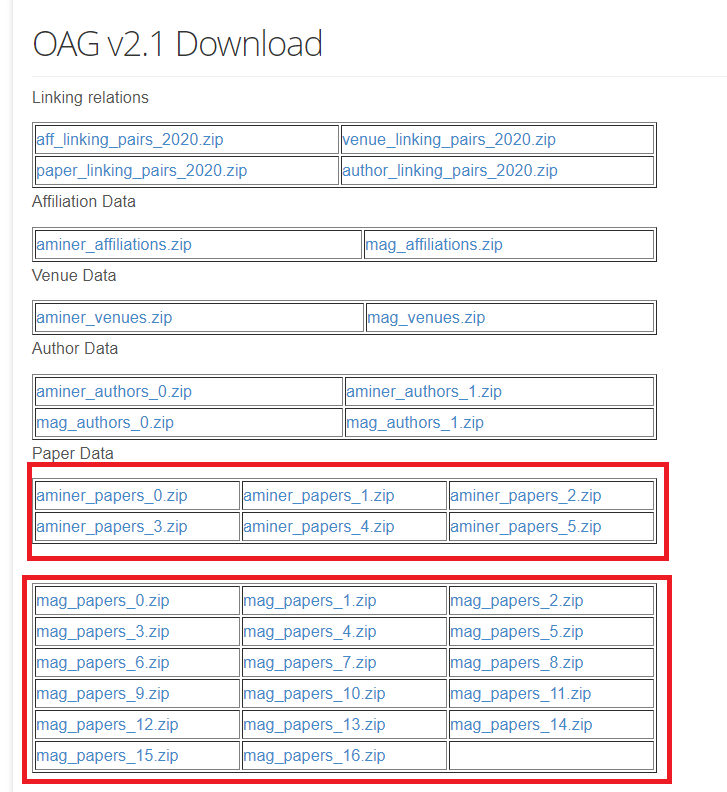
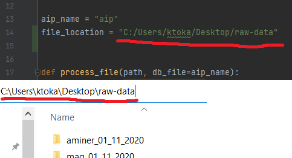
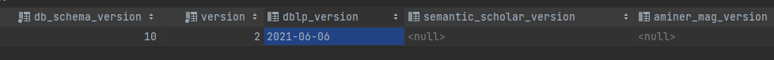

# Generating an AIP database

Disclaimer: The datasets are on the order of several 100 GBs and take a significant amount to process and import into a PostgreSQL database.

In order to update the database you must download all 4 data sources and parse them. 

1. Create a new folder in the root of the repository where all the input files will be stored with the following command:
    ```sh
    $ export DOWNLOAD_DATE=$(date +'%d_%m_%Y')
    $ mkdir -p datasets/{dblp,s2-corpus,aminer,mag}_$DOWNLOAD_DATE
    ```

2. Download the [DBLP](https://dblp.uni-trier.de/xml/) dataset (`dblp.xml.gz` and `dblp.dtd`):
    ```sh
    $ wget -P datasets/dblp_$DOWNLOAD_DATE https://dblp.uni-trier.de/xml/{dblp.xml.gz,dblp.dtd}
    ```
   
3. Download the [Open Academic Graph](https://www.aminer.org/open-academic-graph) dataset which contains the Aminer and MAG papers using the following commands:

    ```sh
    $ wget -P datasets/aminer_$DOWNLOAD_DATE https://www.aminer.cn/download_data\?link\=oag-2-1/aminer/paper/aminer_papers_{0..5}.zip
    $ wget -P datasets/mag_$DOWNLOAD_DATE https://www.aminer.cn/download_data\?link\=oag-2-1/mag/paper/mag_papers_{0..16}.zip
    ```

   This will download the following files:
   

4. Download the Semantic Scholar dataset by following the [instructions](https://api.semanticscholar.org/corpus/download/) to get the latest corpus and store the files in the `s2-corpus_$DOWNLOAD_DATE` directory.

6. After downloading all the files, unzip them.

7. After making sure all files are unzipped and stored in the same folder, change line 14 in the `renew_data_locally.py` which is located in the parser folder, to the correct path of the folder you downloaded all the files to.

   

8. Finally, run the `renew_data_locally.py` file.

9. After re-parsing the whole database, make sure to add the version dates of all the downloaded sources into the database.

   